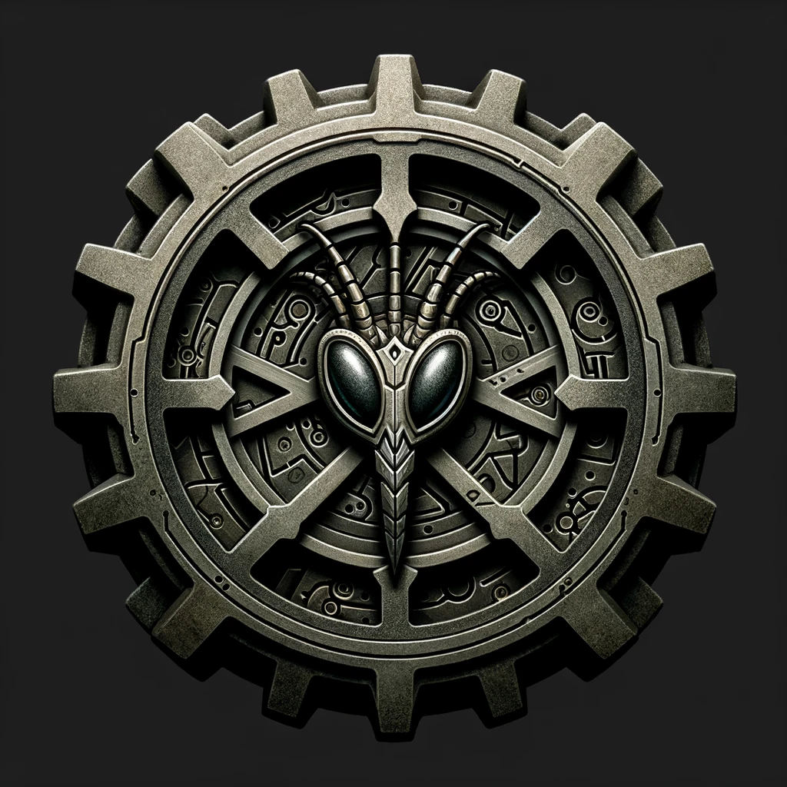

# Tar'kiz Token

Tar'kiz Tokens are small cogs Artificer Tar'kiz hands to contributors to the Archives. Spinning the cog magically enhances one's mental processing power.

Tar'kiz Token Instructions:

> You can use a Tar'kiz Token to give +5 to your ability check when you use a time unit on a research initiative in the `#library`. Only one token may be used per time unit. You can use a token after a roll, but must use it before another.
> You may also apply tokens towards Intelligence checks for your character's trainings. 1 per time unit.
> Tokens are awarded to players, not characters!

