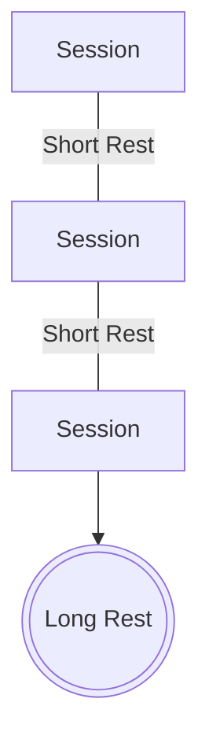

# Basics

## DM Fiat

DMs reserve the right to adjust any rules at any time for the sake of fairness, balance, or fun.

## Portal

The [portal](../archives/portal) is mysterious, but operates on its own mostly consistent set of rules. The portal opens at 7pm and closes promptly at 8:45pm real world time on game days. Portal usage out of game (i.e. via Discord) will have a posted limit on when the portal will close.

## Rest Schedule

In between every session is a rest, with everybody on the same schedule. The pattern:

:::tip Character too burnt out?
Consider creating an alt character if playing all 3 sessions a long rest cycle.
:::

## Levels

No experience is awarded in the game. Instead, experience is represented by paying gold which represents how you buy training time with experts in the guild. [Experience Point table](https://www.dndbeyond.com/sources/basic-rules/step-by-step-characters#XPandProficiencyBonusProgression).

:::important Experience is Accumulative
Level 2 requires 300 xp and level 3 requires 900 xp, so the cost from 2->3 is 600 xp.
:::

## HP at Each Level

At first level, your character's HP is the maximum roll on your Hit Die + DON modifier as normal.
At every subsequent level, roll your new level's hit die.
You may then choose to take the result of your roll or choose to instead use the average of the roll rounded down.
In either case, add your CON modifier as normal.

:::tip Example

### Conan the Barbarian

1. Rolls 1d12 and gets a 9.
2. Keeps this roll and adds his CON modifier of +3 for a total of +12HP.
3. This health is added to both his current and total HP.

### Squish the Wizard

1. Rolls 1d6 and gets a 2.
2. Chooses to take the average rounded down of 3 instead, then adds his CON modifier of +0 to gain a total of +3HP.
:::

:::danger
There have been reported issues with DNDBeyond's HP calculator. [sic]
Please double check your HP on DNDBeyond and if necessary use manual overrides or manipulations to make it correct in that system.
:::
