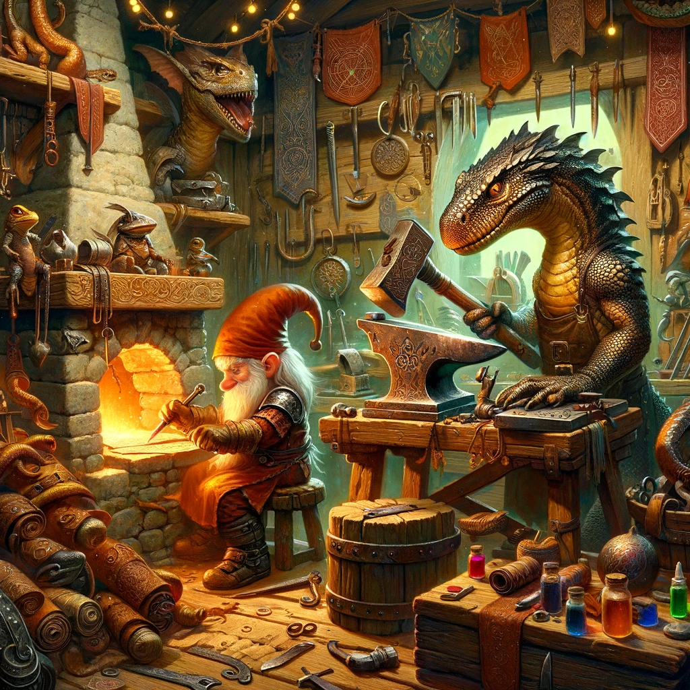

# Leatherworking and Blacksmithing

## Weapon and Armor Enhancements

Characters proficient in leather working or blacksmithing may work to change the properties of certain armors, weapons or create new nonmagical items with different benefits. Magical items cannot be altered or enhanced in this way.

## Leatherworking

Basic leatherworking proficiency options: heavy armor muffling, leather armor extra padding, slippery leather armor, climbing gloves.

## Blacksmithing

Basic blacksmithing proficiency options: spiked armor, weighted armor, ornate armor, keen blade, spiked crusher, ripping piercer.

