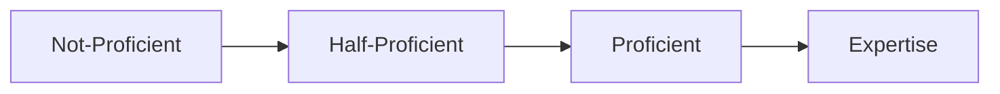

# Downtime

While you are resting at the Guild Hall, you have some time to spend however you like.
Talking to people is free, but any significant use of time that requires a roll means sitting down and focusing on it for several hours.

- During short rest weeks, you will have 2 time units to spend.
- During long rest weeks, you will have 6 time units to spend.

Downtime activities will have a roll, threshold, cost, and reward.
All of these parameters will be determined by the DMs and revealed to you prior to the start of the activity.

:::tip Missed Session?
You may perform downtime activities even if you missed the in person session.
:::

## Multiple Characters

You can only perform downtime activities on Discord for 2 player characters at max for any given week.

## Roll

The skill or tools you will use to make progress towards this activity. (For example, if you are crafting something, you will make a skill check with artisan’s tools). The result of the roll is the number of points you put towards reaching the threshold. Some rolls may require the character to be proficient to attempt, or may impose disadvantage if you are not proficient.

## Threshold

Every roll you perform makes progress towards the activity threshold. The threshold is set based on the difficulty of the activity. Points are cumulative (so you can continue activities from week to week) and multiple characters can spend their time to collaborate towards the same goal. The threshold must be surpassed for the activity to be completed. (For example, difficult historical research might be listed as History-50 meaning 50 total points from history checks must be rolled to complete the task. This would require one person spending several time units, or several people chipping in.)

## Cost

Some activities have a gold cost associated with them. This gold cost must be paid before the activity is considered completed.

## Reward

The outcome of the activity. Some examples: new game knowledge, new skills, new quest lines, a benefit for the guild, or even direct payment.

There is no limit to the types of activities you can perform. If you explain what you hope to accomplish, the DMs will determine the required rolls, thresholds, and potential cost you need to meet to achieve your goal.

## Examples

Listed here are some examples based on commonly performed or requested activities.

### Research

Research a topic in the library or investigate something in the guild. Thresholds start low (10) but get higher with the difficulty of the topic

### Jobs

Do a job for payment. A good way to earn some cash. There are no thresholds for jobs, and instead you are paid out based on the result of your rolls. Typical payout is ~25gp per time unit spent.

:::note
The gold payout is calculated with [15gp per time unit] + [combined rolls]. 
:::

When performing downtime jobs, you can report your rolls, number of time units spent, and a description of the activities that you performed in an appropriate public channel, and a DM will let you know how much gp you earned.

Here are some example types of jobs that Guild members have performed, along with the corresponding skill rolls:
* **Physical labor**: Athletics + Constitution
* **Tavern cooking**: Dexterity + Wisdom
* **Waiting tables**: Dexterity + Charisma
* **Gardening**: Nature + Survival
* **Soliciting donations**: Persuasion + History
* **Guard duty**: Consititution + Perception
* **Research assistance**: Intelligence + Wisdom
* **Hunting/skinning**: Survival + Sleight of Hand
* **Guild paperwork**: Intelligence + Wisdom
* **Arcane lecturing**: Arcana + Performance

### Guild Service

Help around the guild for various effects ranging from morale boosts to increasing potion availability. Various thresholds.

### Bonus Mission

Go on a Discord-based extra mission. **Performing this activity costs 2 time units.**

:::caution Resource Usage
Bonus missions take place after the rest, so any spells or abilities used and damage taken will be applied at the Monday session.
:::

### Learn or Improve a Skill

Work towards learning a **skill** you are currently not proficient in or becoming an expert in a skill you are proficient in. This includes learning to work with **tools** or new **languages**. These activities will have high thresholds and high gold costs.

Improving skill proficiencies requires that a character build their proficiency sequestially over time from not proficient to expertise.

:::caution L-SCAB Fees
The Lemurian Skill Certification Approval Board (L-SCAB) will not recognize skill certification until they are paid.

gp can be paid at any point but the skill is only learned once the gold has been paid to the L-SCAB.
:::

### Combat Skills

Change out class options, work out combination attacks with other characters, or improve the abilities of animal companions.
Variable thresholds and gold costs depending.
You can perform the same activity multiple times in a row as long as you have the time units.
