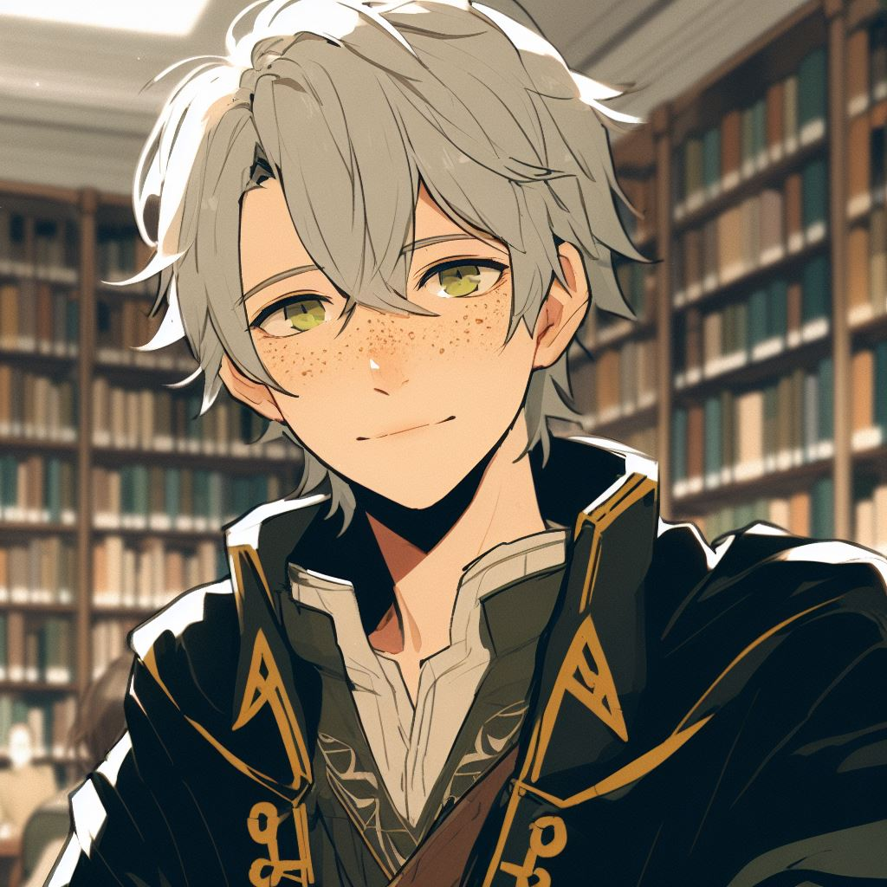

# Ashe

import Admonition from '@theme/Admonition';

## Background

Ashe is an 18 year-old human intern for the Lumerian Guild's library. He was an immature, naive young teen when he joined the guild. However, he has since become relatively bitter and reserved towards most adventurers after guild members stalked him on a date with Writ Scribbler.

He may act suspicious but in the end of the day he is an immature, self-conscious teen that feels very misunderstood by the world. 

<Admonition type="caution" icon="🐀 & 🦉" title="">
    
 🦉 - "You mean 'AND' suspicious" 

    
 🐀 - "No, he's really sweet when you get to know him." 

    
 🦉 - "He brought you into a dark alleyway and kinda-sorta threatened you with a ballista." 

    
  🐀 - "Well I could have dodged it!" 

</Admonition>

Ashe is a follower of Beshaba, goddess of misfortune and ill-luck. His father is the bishop of Beshaba.

Ashe has a propensity to create misfortune for everybody around him. 

## At the Guild

Several adventurers mistook his naivite for nefarious intentionsmotives. They tried to follow him on a date with [Write Scribbler](writ_scribbler). Said adventurers were discovered. 

During the spider infestation, Ashe was killed by a stray arrow from Draven. Feirfiz was able to quickly resecitate him with a Revivify. Draven attempted to teach Ashe runecraftering after killing him to make up for accidentally killing him.

Eversince, Ashe has been warry of most adventurers. He gets along with Chuck and Minimo though. 

## Ashe's Adventure

Shortly after Draven's death, Ashe went on an adventure to prove that **Wyrmfrost Appliance Works** had infridged on **Gnomish Gearwrights Co.** patent. In short this is what happened:

- Ashe completed the mission to find the ruins of a very old magical refrigerator, which provided necessary evidence for his client to win their case. Big payouts, everyone happy, no loose ends except for maybe a rival enemy corporation.
- Met three reclusive ice giants who know a little of the Lumerian Guild and Draven’s rune techniques. They shared a special rune with Ashe. 
- Ashe encountered a scary lake ghost promising treasures. 
- There were some frost druids that seemed cool and gave Ashe an awesome staff. The staff's effects are unknown.
- Ashe received a cool icy rose. It was given to Ni Ama to cheer her up and to Write Scribbler as a gift.

## Fun Facts

- Ashe paints
