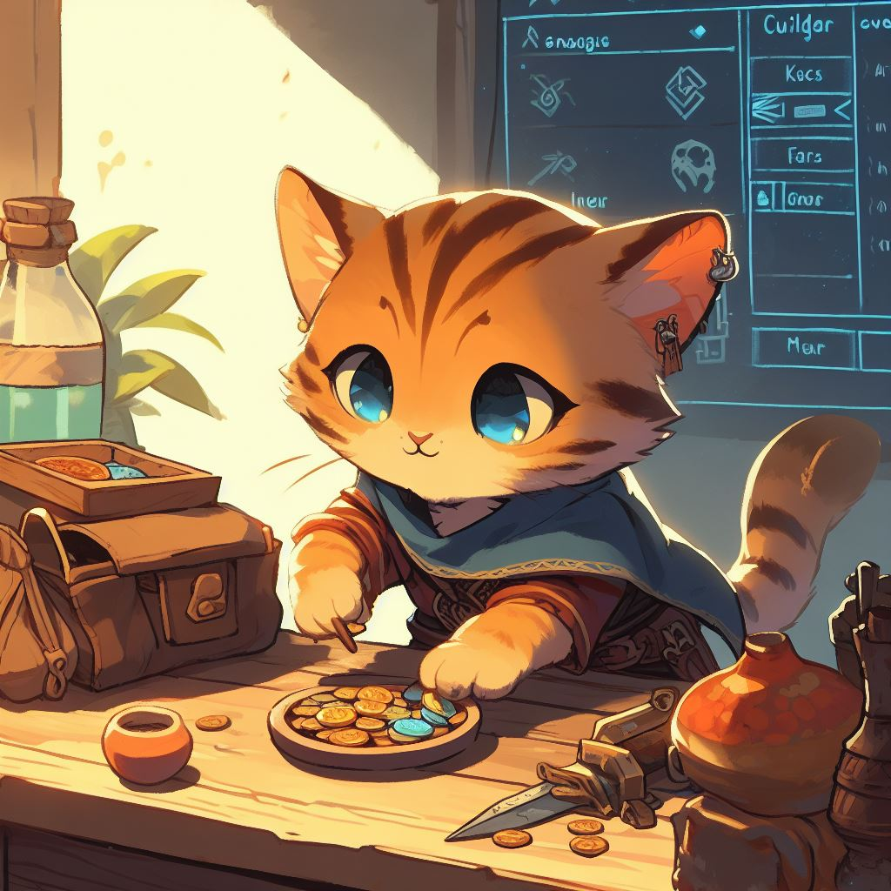

# Money Clan Cats

The Money Clan are a family of Tabaxi vendors.
Kahjit, Khajit, Kitjit, and Tax Break are all members of the Money Clan.  
They sell trinkets, potions, and all kinds of goods to guild adventurers in the exchange. 

## Kahjit & Khajit

Purveyor of Fine Goods

He [has wares if you have coin](https://youtu.be/LQvsA8uduGA?t=1).

Kahjit and Khajit are often mistaken for being the same cat. They are not. They are twin brothers.

## Kitjit

Kitjit is a young nephew of Khajit. They are very excitable and will ruthlessly fleece you of all your money.

