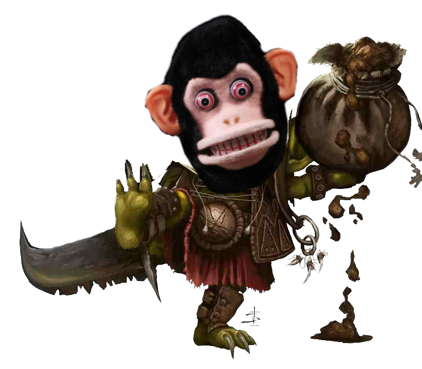

# Snorkels

## Background

Snorkels is a monkey faced menace upon society.
It can occasionally be seen shoving creatures into a seemingly bottomless bag of holding.
Whenever Snorkels is found either in the guildhall or on a guild member's mission, it will pull out creatures from its bag.

The Guild provides hazard pay to guild members who minimize the damage of "Snorkels Events".

## Snorkels Events

> :warning: **WARNING**: Snorkels is exceedingly dangerous. Approach the monkey at your own risk.
> There are 2 types of Snorkels events:

1. **A Bag Episode**  
   Snorkels will place a bag of holding on the ground and throw out 3 "rounds" of monsters from his bag of holding.
   Guild members are paid to slay these monsters.
2. **Snorkels goes on an Adventure!**  
   Snorkels joins the adventuring party on a regularly scheduled mission.
   Guild members must babysit Snorkels while he actively makes their lives harder.

> _House Rule_: Any monster parts looted from Snorkels' monsters can only be used for cosmetic upgrades
