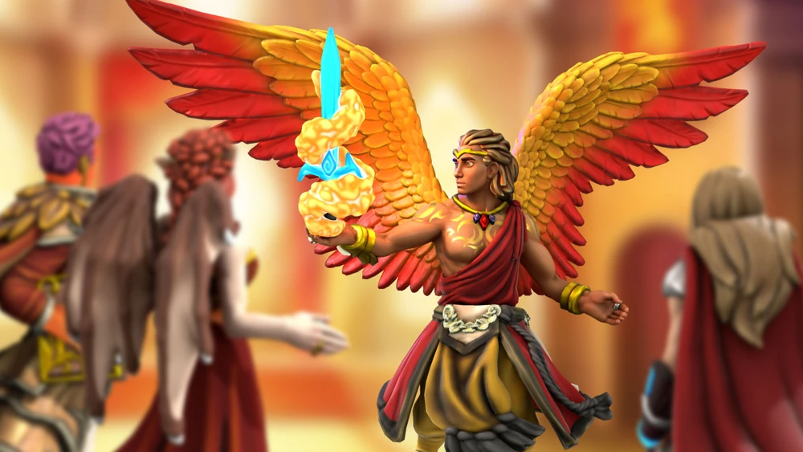
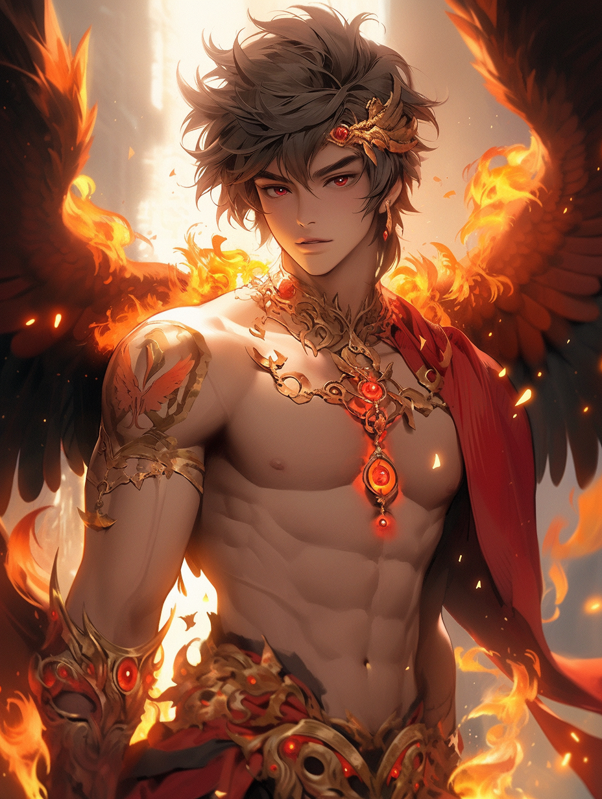
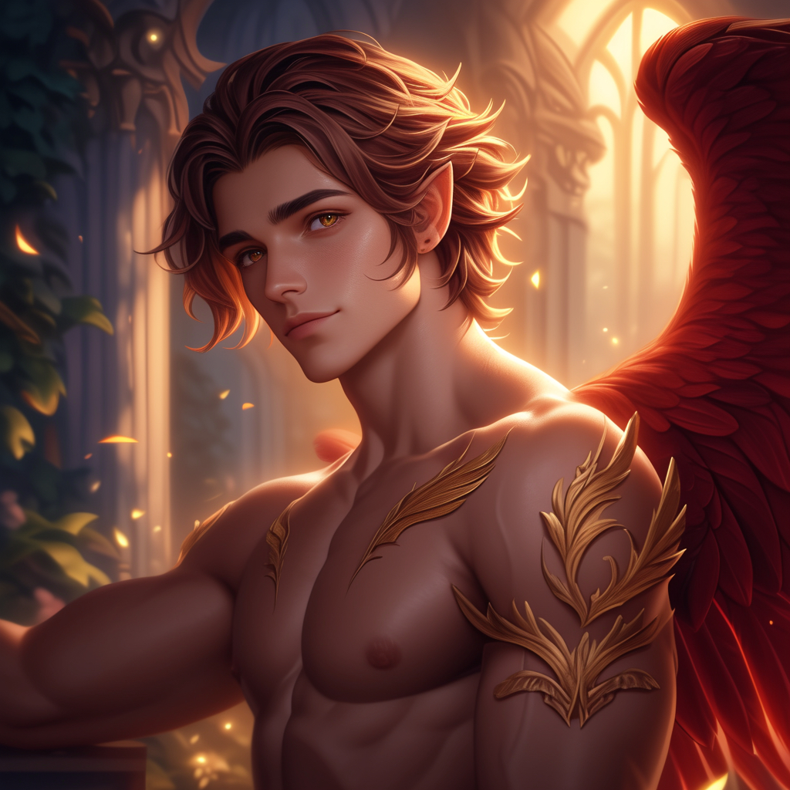

# Feirfiz du Koden Kal

Aasimar Divine Soul Sorcerer.

A holy blaster with a side of support spells.

 [Model](https://www.heroforge.com/load_config%3D33582062/)

## Backstory

Feirfiz was born on another world. The love between his fathers, King Fajar du Koden Kal and the knight Galahad du Lac, was so great that they were gifted a son, created from their combined essence by the goddess Sarenrae. However, his idyllic childhood would not last long, as the enemies of the kingdom conspired to wipe out Koden Kal. Feirfiz survived several assassination attempts, but finally one resulted in him being banished from his home plane entirely. Finding himself in Lemuria, he heard about the famous portal of the Lemurian Adventuring Guild, which he quickly joined. He is hoping to unlock the secrets of the portal to find a way back home.

## Time in the Guild

While in the guild Feirfiz became a popular icon. Artwork of him dons the galleria and dolls of him have become somewhat popular among children.

Feirfiz had asked Illantriss to marry him, but after his unexpected demise and subsequent revival, he lost all memory of his marriage proposal.

## Galleria du Feirfiz
Several of Feirfiz’s stunning modelwork are showcased in this gallery and further down.

