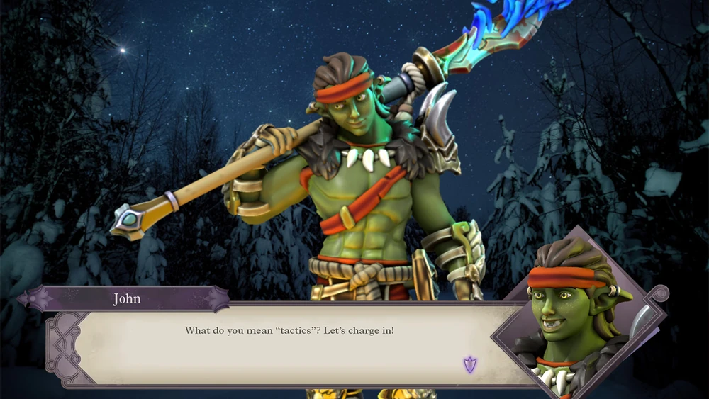

# Jo'hannar "John" Smith

Half-orc/Half-elf warrior.

A brawny frontliner.

 [Model](https://www.heroforge.com/load_config%3D33582046/)

## Background

John grew up learning blacksmithing and combat from his orcish father "Clint". During the _Song of Morningvale_ missions, he one of the only ones to notice when the town started being devoured by a False Hydra. When the Guild came to investigate, he assisted them in finding and slaying the monster. As the guild members began to teleport back, he decided he wanted in on the action, and grabbed one of them and came back to the Guild with them.

## Time in the Guild

### The Guild's Weaponsmith
John has become known within the guild for his excellent craftsmanship. Several of his swords have been bought by his fellow guildmates and helped them ~~barely escape death~~ defeat the mightiest of foes. 

### The Dragon Slayer Inn

Following an attack on the Capitol, John bought land and built the Dragon Slayer Inn.