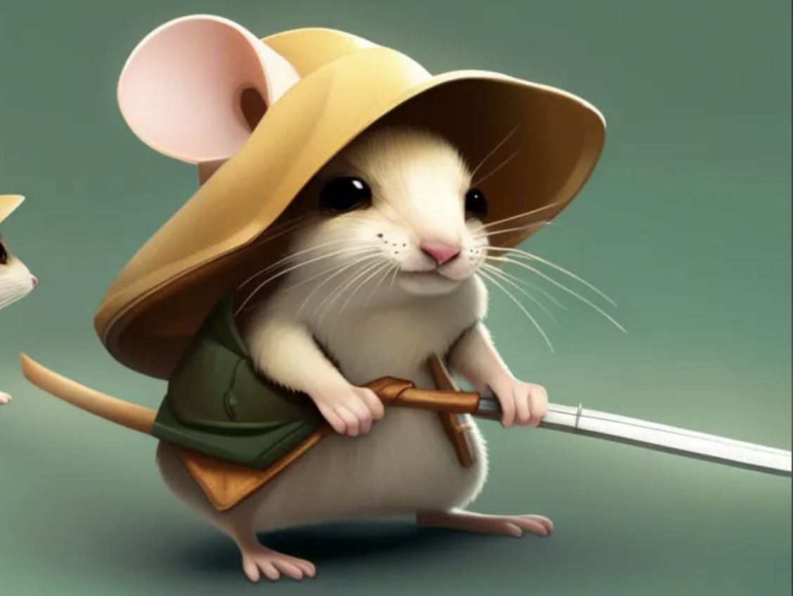

# Minimo

:::danger RIP 2/23/24
Stabbed in the heart by Lucy during the undead assault on the Capital.
:::

## Class and Race

Kangeroo mousekin bladesinger wizard

### Equipment

Cloak of Elvenkind

### Skills and Languages

Cooking, Land Vehicles

Common, Sylvan

## Background

Position: Guild Archivist

Minimo is a kangeroo mousekin wandering librarian. His goal make it easy for all people to find and learn the secrets for the world. He'd go from town to town helping sort their libraries and made them more accessible to the local populace. It is easy to forget the stories of heros if their stories are not written down. He came to the Lemurian Guild in order to help them write dossiers and clean up the Archives.

Minimo will have kleptomaniac episodes whenever he is frightened or threatened. He does not remember anything from the episodes.

Despite being scared of everything, Minimo calms down when he hears music. Enemies fear the lullaby sung from his lips when he enters murder mouse mode.

Over his time traveling he learned how to cook really well. He hopes that when he eventually dies he'll be cooked into a good stew

Titles:

- Tallguard
- Murder Mouse
- The Expensive One

## Familiar: Sir Giblet

Sir Giblet is Minimo's smallguard. His is very eloquent and cleans up all of Minimo's messes.

Sir Giblet is Minimo's accountant, PR consultant, and execuative assistant.

Sir Giblet was resummoned by Ni Ama following Minimo's Death.

:::info In-game: Familiar
Game-wise, Sir Giblet is a reskinned fey familiar.
:::

## In the Guild

Minimo's first mission was to apprehend the Phantom Thieves. His kleptomania flared up and caused him to instinctually grab a broken [Bead of Fog] that creates perpetual fog whenever it is touched. His theft was found out when he tried to cast [identify] on the bead in the Garden. Guildmembers were unable to swipe the bead away from Minimo until Sir Giblet appeared and knocked the Mousekin out. Minimo was fined for this theft.

Minimo does not have a strong grasp of his finances because he buries all of his gold and treasures in the Garden. 

### Job Application
Sir Giblet urged Minimo to put in a job application for Kahjit's job listing. Unfortunately, nepotism won out and Taxbreak got the job over him.

## Kangeroo Mousekin Lore

Kangeroo Mousekin are reculsive, jumpy critters. Most of the time, they look exactly like a kangeroo rat but are significantly more intelligent. A few of them are comparatively giant. Tallmice as they are called, grow to be between 1.5-2.5 ft tall. Unlike their smaller counterparts, they CAN speak common. Tallice are often representatives for the smallfolk. They may be active guardians of smallfolk burrows or may travel between towns gathering winter supplies, but the vast majority of them are ambassadors. They try to create legal protections or carve out places for the small to live besides the tallfolk. This has rarely worked but they continue to hope it may someday.

Smallguard is a highly prestigous job that many smallfolk children aspire to be when they grow up. The smallguards protect hidden mousefolk villages from monsters but also regular predators like cats, raccoons, and owls. They are fearless. There is a childhood story of a 5 mouse team destroying a single eagle's nest. They worked together to craft rope, scaled a giant oak, and fought the eagle as if it was a dragon all in order to destroy the predator's nest. Smallguard keep the smallfolk safe from the many monsters that would see them as prey.

The greatest of smallguards are knighted and become retainers to the tallguards. As retainers, they act as accountants, watch mice, and the assistant for the tallmouse's ambassador needs.

### Mousekin Terminology

- Smallfolk - Regular sized kangeroo mousekin
- Tallmouse - A tall kangeroo mousekin.
- Tallfolk - Anyone taller than 2 feet.
- Smallguard - Smallfolk retainers and guards.
- Tallguards - A prestigious title given to mousekin who is recognized for protecting the smallfolk, it's cultures, and/or it's histories.

## Death

### Memorial Eulogies

#### Illantris

> Dressed in what is becoming a too often used black mourning dress, Illantriss steps forward.
> 
> "For all his short size, Minimo's presence, personality, exuberance, humor, and culinary talents came to dominate a large space in all our lives. His winning personality no better displayed by the fact he could be the culprit of so many small thefts around this place, yet still be loved and cherished by all. 
> 
> We will miss his inquisitive mind, ceaseless creativity, passion for history and learning, and constantly being reminded on how delicious he would've been if cooked a certain way. 
> 
> The loss of his light in our Guild is tragic. He died as he lived. Boldly. Facing against overwhelming odds. There won't be another like him. And....I will dearly miss having him to cook with. And throw cookies at when I'm "mad" at him. And our late night research sessions in the library. And..and...and him. Goodbye Minimo darling. I'm...so sorry love."
>
> places an assortment of mouse shaped cookies, marshmallows, and candy beside his body.

#### Tar'kiz
> Tar'kiz makes his way to the front.
> 
> "Little mouse Minimo,
> came to the library for his brain to grow.
> Researching to be in the know,
> his contributions tall despite his stature low.
> His departed soul leaves us a field of snow,
> till that one day we might once again say hello."
> 
> He pulls out a microfiber cloth to dab his first-time teary eyes.

#### Sister Charles

> Sister Charles (aka: Nun Chuck) slowly walks to the front, desperately trying to hold it together
> 
> “To our compatriot, Minimo, tall guard captain, blade slinging wizard, wielder of the green flamed scimitar, liberator of imprisoned shiny objects, manufacturer of mana mooncakes, the perfect secret Bugmas gift giver, a tasty morsel in himself  but never consumed, and our friend. My friend.”
> 
> she wipes a tear and continues
> 
> “Minimo was a contradiction. So terrified of being eaten yet so very, very brave when facing the undead. Minimo never flinched in battle and always had the most creative and chaos inducing work arounds to the impossible situations. And he executed his ideas with flair, creating times the guild will recount forever.”
> 
> deep, shaky breath
> 
> “But to me, he was a good and faithful friend. He fostered my dreams of becoming a map maker after we trauma bonded on the disastrous tomb trekker mission that claimed Bavazi and almost cost the rest of us our lives. Yet, his cool head and his unquenchable grit helped to get us out of the death trap. We grieved the loss of Bavazi together, planned Bavazi’s rescue together, and then ultimately sacrificed himself for the safety of his team and the guild and Lemuria. My sweet mouse friend….”
>
> she now hiccups and tears splash onto his corpse
> 
> “…… my dear, dear  friend. May your spirit be at rest among your kind. May you be honored and revered for fulfilling the tall guard creed. And may you somehow, somewhere know how desperately you are missed by those left behind.”
> 
> she presses a small pearl into his paw because he would have so loved this shiny and leaves in a sorry, soggy state, inconsolable and heartbroken 

#### Anfroy

> A pale and tearful Anfroy steps up. 
> “I haven’t been here long, but on my first mission Minimo saved me. He was amazing in battle. I wanted to learn from him. I can’t believe he is gone.” 
> Anfroy turns and walks to the back of the room.

#### Fenris

> Fenris achily steps up to the memorial, his face grim. 
> 
> “I wouldn’t be here today if it weren’t for Minimo. In the undead tombs, he blessed me with Longstrider to make sure I didn’t fall behind; I would have been lost alongside Bavazi if not for him lifting me up. That’s something he did for all of us — lifting us up. Despite his small size, he made all of us stand taller, laugh harder, go farther. He was a bright light in this sometimes dark place.”
> 
> “Minimo, I’m sorry I couldn’t save you this time. I was so close,” Fenris sighs with pain in his voice, “but you slipped right through my fingers. I’m…I’m really sorry. We’re going to miss you.”
> 
> Fenris looks worn out as he steps back.

#### Eligos

> Arriving late, Eligos approaches threads through the rows and rows of open caskets, searching for Minimo. When hefinds it, he stands, silent as he sets two satchels of pink rose sea salt behind each ear. Then he places two of his old primaries into the casket as well, before heading to the podium.
> 
> "Today, we gather with heavy hearts to honor the life of a dear friend, Minimo… and by extension, our connection to Sir Giblet. As we come together in remembrance, we celebrate two lives that touched each of us in profound ways.
> 
> "Minimo was more than just a friend; he was a beacon of light in our lives, with those green flame scimitars and propensity for mischief. His pursuit of knowledge was admirable, but even more so, his warmth, kindness, and unwavering support endeared them to everyone he met… Well, almost everyone. He had a way of making everyone feel valued, and never hesitated to charge out to be the first line of attack.
> He is – was also a pillar of strength. In times of hardship, he stood steadfast, offering words of encouragement and a shoulder to lean on. He danced to his own tune, and well, had a rather interesting way of making light of his own mortality. 
> 
> "And Sir Giblet – I – perhaps it’s foolish to be saddened at the loss of Minimo’s familiar, but… I can’t help but to mourn that we might never seem him again. Giblet was, in many ways, one of the most diligent creatures I know. Accounting, diplomacy, witty humor – he was without compare. One of Giblet's greatest gifts was his ability to spread joy wherever he went. I truly hope that when the familiar bond dissipated and returned him to his home, and that the shock of it didn’t kill him. Perhaps he’s on a well-deserved vacation."
>
> Eligos shakes his head, and clears his throat before speaking again.
> 
> "Minimo lived life to the fullest, embracing every moment with enthusiasm and zest. He pursued archival work and culinary skills with such fervor, always eager to learn and grow. Whether it was exploring new places, trying new experiences, or simply savoring the beauty of everyday moments, he lived with a sense of wonder and curiosity that was truly inspiring.
> 
> "Though Minimo may no longer be with us in body, his spirit lives on in the memories we hold dear. He’s have left an indelible mark on our hearts, and his legacy of love and friendship will continue to guide us in the days ahead
> 
> "Rest in peace, dear friend. You will be deeply missed, but your light will shine on in our hearts forever."

#### Ni Ama

> Ni Ama walks to the casket and stares down at his body for a time.
> "I felt the most like myself I had in a long time when we hunted together. You were mad, but you were mad in the best way possible. Fearless, reckless, and selfless. 
> 
> her brow furrows
> I don't...feel...in this form like I did in Winter. Sorrow, sadness, loss, despair...are muted now. Anger, vengeance, and a constant desire for motion are all that remains. So I cannot mourn you. Instead, I will send you off in the most glorious of flames, the brightest and colorful I can manage. 
> And.... I can promise you this Minimo. 
> 
> We will find those responsible. 
> We will destroy them.
> We will dance upon their ashes. 
> We will avenge you and your memory. 
> leaning down she touches her forehead to Minimo's.
> Umana spirit  shelter xijat liphatmei homeland.  Demant jishet phe  sy umana soul xijat se Feywild, phe shall tend qit, fyd qit, demant  qit easy labors xijat se  untasen.
> [May your spirit find shelter in our homeland. And if I should see your soul in the Feywild, I shall tend it, feed it, and give it easy labors in the life to come.]  (sylvan speakers)